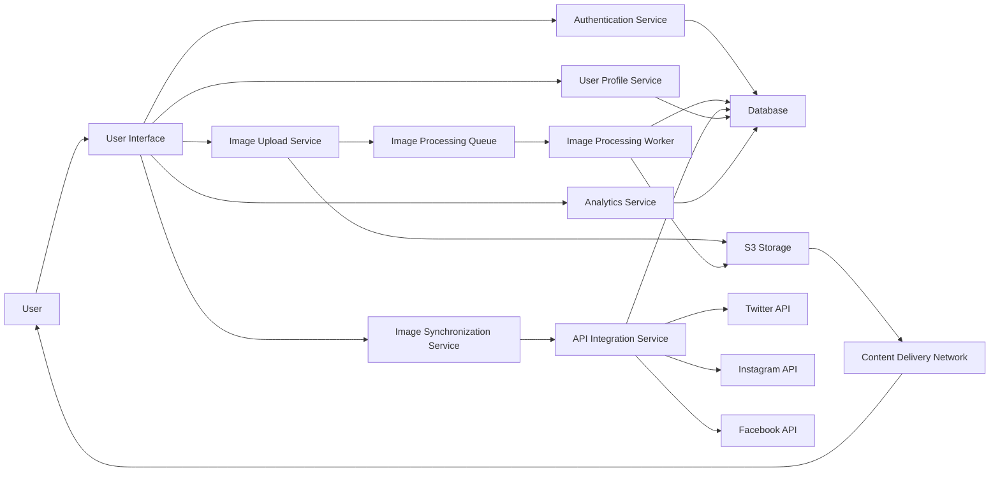
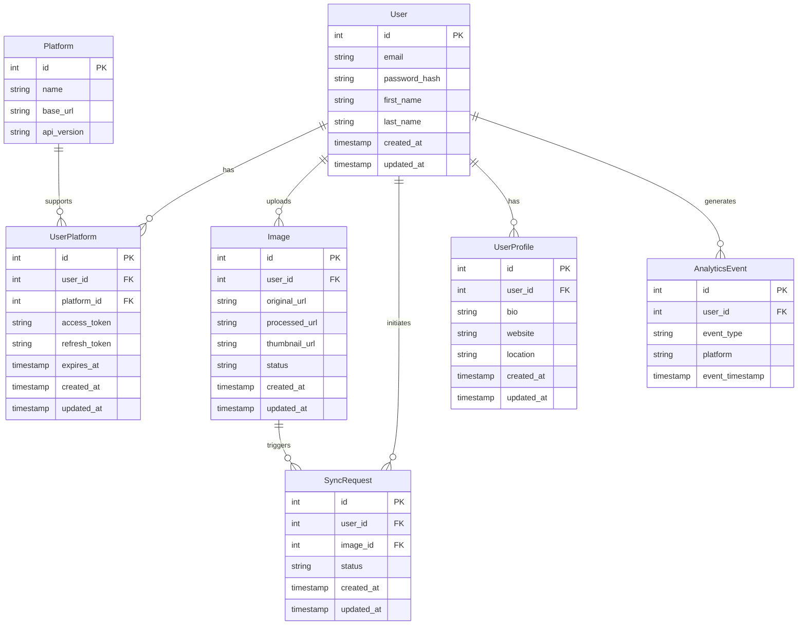

# Linkarooie System Design Document

## Table of Contents

1. [Introduction](#introduction)
2. [System Overview](#system-overview)
3. [Functional Requirements](#functional-requirements)
4. [Non-Functional Requirements](#non-functional-requirements)
5. [System Architecture](#system-architecture)
6. [Database Schema](#database-schema)
7. [API Integration Flow](#api-integration-flow)
8. [Security and Compliance](#security-and-compliance)
9. [Deployment and DevOps](#deployment-and-devops)
10. [Conclusion](#conclusion)

## Introduction

Linkarooie is a revolutionary platform that simplifies the management and synchronization of online presence across popular platforms like Twitter, Instagram, and Facebook. It provides users with a centralized hub to upload, manage, and synchronize their profile images and banners, ensuring a consistent and professional digital identity.

## System Overview

Linkarooie aims to solve the problem of fragmented online presence by offering a unified solution for image management and synchronization. It eliminates the hassle of manually updating profile information on each platform, saving users time and effort. Linkarooie ensures that users can present a cohesive and up-to-date digital identity, enhancing their online brand and credibility.

## Functional Requirements

1. User Authentication and Authorization
2. Image Upload and Management
3. Image Processing and Optimization
4. Platform Integration and Synchronization
5. User Profile and Settings
6. Notifications and Alerts
7. Analytics and Reporting

## Non-Functional Requirements

1. Scalability and Performance
2. Reliability and Availability
3. Security and Data Protection
4. Usability and User Experience
5. Maintainability and Extensibility

## System Architecture

### High-Level Architecture Diagram

### Scalability and Performance Considerations

- Horizontal Scaling
- Caching
- Asynchronous Processing
- Database Optimization
- Content Delivery Network
- Monitoring and Auto-Scaling

## Database Schema

## API Integration Flow

## Security and Compliance

1. Authentication and Authorization
2. Data Encryption
3. Secure API Communication
4. Input Validation and Sanitization
5. Logging and Monitoring
6. Regular Security Audits and Updates
7. Compliance with Data Protection Regulations
8. Employee Training and Access Control

## Deployment and DevOps

1. Containerization with Docker
2. Container Orchestration with Kubernetes
3. Infrastructure as Code (IaC)
4. Continuous Integration and Continuous Deployment (CI/CD)
5. Automated Testing
6. Monitoring and Logging
7. Scalability and High Availability
8. Disaster Recovery and Backup
9. Security and Compliance
10. Continuous Improvement and Optimization

## Conclusion

Linkarooie represents a significant advancement in online presence management, empowering users to effortlessly synchronize and maintain a consistent digital identity across popular platforms. By following the system design principles and considerations outlined in this document, Linkarooie can be developed as a robust, scalable, and user-centric platform.
