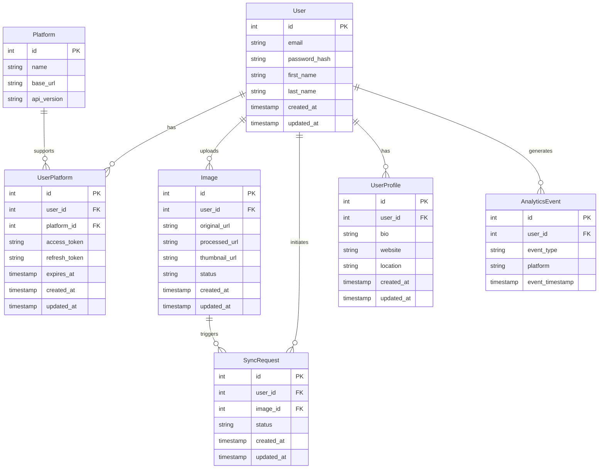
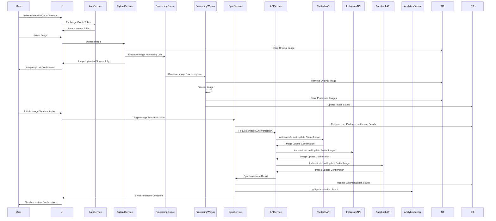

# Loftwah's Ultimate Guide to System Design: A Comprehensive Analysis of Linkarooie

## Introduction to System Design

System design is a crucial aspect of software development that forms the backbone of building robust, scalable, and maintainable systems. It involves understanding the system's requirements, defining clear specifications, and creating a detailed blueprint that guides the development process. A well-designed system architecture ensures that the system can handle growth, adapt to changing needs, and deliver a seamless user experience.

In this guide, we'll embark on a deep dive into the world of system design, using Linkarooie, an innovative platform for managing and synchronizing online presence across popular platforms like Twitter/X, Instagram, and Facebook, as our case study. We'll explore the functional and non-functional requirements, system architecture, components, and various considerations that go into designing a complex system like Linkarooie.

## Linkarooie: Revolutionizing Online Presence Management

### System Overview

Linkarooie is a game-changing platform that simplifies how users manage and synchronize their online presence across multiple platforms. It provides a centralized hub for users to upload, manage, and synchronize their profile images and banners, ensuring a consistent and professional digital identity. Linkarooie eliminates the hassle of manually updating profile information across various online services, saving users time and effort.

### Core Features and Value Proposition

1. **Centralized Image Management**: Linkarooie offers a single platform for users to upload and manage their profile images and banners, eliminating the need to update them individually on each platform.

2. **Automated Image Synchronization**: With Linkarooie, users can automatically synchronize their profile images and banners across supported platforms, including Twitter/X, Instagram, and Facebook, ensuring a consistent and up-to-date online presence.

3. **Image Optimization**: Linkarooie automatically adjusts and optimizes images to meet the specific requirements of each platform, guaranteeing a professional and visually appealing appearance.

4. **Secure and Efficient**: Linkarooie prioritizes user data security and employs robust authentication and authorization mechanisms. It efficiently manages user credentials and integrates seamlessly with external platforms through secure API connections.

5. **OAuth Integration**: Linkarooie supports user account creation and authentication through popular OAuth providers such as Google, Facebook, and GitHub, in addition to traditional email-based registration, providing users with convenient and secure login options.

### Solving the Problem of Fragmented Online Presence

Linkarooie addresses the common challenge faced by individuals and businesses in maintaining a consistent and professional online presence across multiple platforms. By providing a centralized solution for image management and synchronization, Linkarooie eliminates the hassle of manually updating profile information on each platform, saving valuable time and effort. It ensures that users can present a cohesive and up-to-date digital identity, enhancing their online brand and credibility.

## Functional Requirements

1. **User Authentication and Authorization**:
   - Implement a secure and user-friendly authentication system that supports various authentication methods, including OAuth providers (Google, Facebook, GitHub) and traditional email/password login.
   - Handle user registration, login, and password reset flows seamlessly, with proper validation and error handling.
   - Implement role-based access control (RBAC) to ensure that users can only access and modify their own data.

2. **Image Upload and Management**:
   - Provide a user-friendly interface for uploading profile images and banners, supporting common image formats (e.g., JPEG, PNG) and enforcing size limitations to optimize storage and performance.
   - Implement client-side image compression and resizing to reduce upload time and bandwidth usage.
   - Handle image validation, error handling, and provide informative feedback to users.
   - Allow users to manage their uploaded images, including editing, deleting, and setting default images for each platform.

3. **Image Processing and Optimization**:
   - Automatically adjust and optimize uploaded images to meet the specific requirements of each supported platform (e.g., dimensions, aspect ratio, file size).
   - Employ efficient image processing techniques to ensure high-quality output while minimizing processing time.
   - Generate multiple versions of each image (e.g., thumbnails, different sizes) to accommodate various platform needs.
   - Implement image caching and content delivery network (CDN) integration to optimize image delivery performance.

4. **Platform Integration and Synchronization**:
   - Develop secure and reliable API integrations with supported platforms (Twitter/X, Instagram, Facebook) to enable seamless image synchronization.
   - Implement OAuth-based authentication and authorization flows to securely access user accounts on external platforms.
   - Handle API rate limiting, error handling, and retry mechanisms to ensure smooth integration and synchronization processes.
   - Provide clear documentation and developer resources to facilitate easy integration with Linkarooie's API.

5. **User Profile and Settings**:
   - Allow users to manage their profile information, including name, bio, and links to social media profiles.
   - Provide options for users to customize their synchronization preferences, such as selecting specific platforms to sync with and setting synchronization frequency.
   - Implement privacy settings to control the visibility of user profiles and synchronized images.

6. **Notifications and Alerts**:
   - Send email notifications to users for important events, such as successful image synchronization, platform connection failures, and account-related activities.
   - Provide in-app notifications and alerts to keep users informed about the status of their synchronization tasks and any required actions.

7. **Analytics and Reporting**:
   - Implement analytics tracking to gather insights on user engagement, platform usage, and synchronization metrics.
   - Generate reports and dashboards to provide users with valuable data on their online presence performance and reach.
   - Offer analytics APIs for users to integrate Linkarooie data with their own analytics systems.

## Non-Functional Requirements

1. **Scalability and Performance**:
   - Design the system architecture to handle a growing user base and increasing data volumes efficiently.
   - Implement horizontal scaling techniques, such as load balancing and distributed caching, to distribute traffic and handle high concurrency.
   - Utilize cloud-based infrastructure (e.g., AWS, Google Cloud) to leverage auto-scaling capabilities and accommodate sudden spikes in usage.
   - Optimize system components and algorithms to ensure fast response times and efficient resource utilization.
   - Conduct thorough performance testing and capacity planning to ensure the system can scale seamlessly.

2. **Reliability and Availability**:
   - Design the system to be highly available and resilient to failures, ensuring minimal downtime and data loss.
   - Implement redundancy and failover mechanisms, such as database replication and load balancer health checks, to handle component failures gracefully.
   - Establish comprehensive monitoring and alerting systems to proactively detect and resolve issues.
   - Regularly perform data backups and implement disaster recovery procedures to ensure data integrity and quick recovery in case of catastrophic events.

3. **Security and Data Protection**:
   - Implement robust security measures to protect user data and prevent unauthorized access.
   - Employ industry-standard encryption algorithms (e.g., AES, RSA) to secure sensitive data both at rest and in transit.
   - Implement secure authentication and authorization mechanisms, such as OAuth and JWT, to ensure secure access to system resources.
   - Regularly conduct security audits, penetration testing, and vulnerability assessments to identify and address potential security risks.
   - Comply with relevant data protection regulations, such as GDPR and CCPA, and provide users with control over their data privacy.

4. **Usability and User Experience**:
   - Design intuitive and user-friendly interfaces that enable users to easily navigate and interact with the system.
   - Implement responsive design principles to ensure a seamless experience across different devices and screen sizes.
   - Conduct usability testing and gather user feedback to continuously improve the user experience.
   - Provide comprehensive documentation, tutorials, and support resources to assist users in effectively utilizing Linkarooie's features.

5. **Maintainability and Extensibility**:
   - Follow modular and loosely coupled architecture principles to facilitate easy maintenance and future enhancements.
   - Adopt coding best practices, such as SOLID principles and design patterns, to ensure code quality and maintainability.
   - Implement comprehensive logging and error handling mechanisms to aid in troubleshooting and debugging.
   - Use version control systems (e.g., Git) and establish clear branching and deployment strategies to manage codebase changes effectively.
   - Design the system to be extensible, allowing for easy integration of new platforms and features in the future.

## System Architecture

### High-Level Architecture Diagram

The high-level architecture of Linkarooie follows a modular and scalable design, leveraging various services and components to achieve its functionality. Let's break down each component:

1. **User Interface (UI)**: The UI is the frontend component that users interact with to access Linkarooie's features. It communicates with the backend services to handle user authentication, image upload, synchronization, profile management, and analytics.

2. **Authentication Service**: This service handles user authentication and authorization. It supports various authentication methods, including OAuth providers (Google, Facebook, GitHub) and traditional email/password login. It securely manages user credentials, generates and validates access tokens, and integrates with the database to store and retrieve user information.

3. **Image Upload Service**: The Image Upload Service handles the uploading and storage of user-provided images. It receives image files from the UI, performs initial validations, and stores them in Amazon S3 for reliable and scalable storage.

4. **Image Processing Queue**: When a new image is uploaded, a message is sent to the Image Processing Queue. This queue decouples the upload process from the actual image processing, allowing for asynchronous and scalable processing.

5. **Image Processing Worker**: The Image Processing Worker picks up messages from the queue and performs the necessary image transformations and optimizations. It generates multiple versions of each image to meet the requirements of different external platforms and stores the processed images back in S3.

6. **Image Synchronization Service**: This service handles the synchronization of processed images with external platforms (Twitter/X, Instagram, Facebook). It retrieves the necessary user credentials and access tokens from the database and communicates with the API Integration Service to initiate the synchronization process.

7. **API Integration Service**: The API Integration Service acts as a bridge between Linkarooie and external platforms. It handles the authentication and authorization flows, makes API calls to external platforms to update user profile images and banners, and handles any necessary data transformations and error handling.

8. **User Profile Service**: This service manages user profile information, including name, bio, and links to social media profiles. It allows users to update their profile details and retrieves profile information from the database when needed.

9. **Analytics Service**: The Analytics Service tracks user engagement, platform usage, and synchronization metrics. It gathers data from various system components, processes it, and stores the insights in the database. It provides APIs for retrieving analytics data and generating reports.

10. **Database**: The database stores user information, access tokens, image metadata, user profiles, and analytics data. It is designed to be scalable and supports efficient querying and retrieval of data.

11. **S3 Storage**: Amazon S3 is used as the primary storage solution for user-uploaded images and processed image versions. It provides high durability, scalability, and accessibility, ensuring that images are reliably stored and can be quickly retrieved.

12. **Content Delivery Network (CDN)**: A CDN is employed to optimize the delivery of images to users. It caches images at edge locations worldwide, reducing latency and improving the overall user experience.

### Scalability and Performance Considerations

To ensure scalability and optimal performance, the system architecture incorporates several key techniques:

1. **Horizontal Scaling**: The Image Upload Service, Image Processing Worker, API Integration Service, and other critical components are designed to scale horizontally. Multiple instances of these services can be deployed behind load balancers to distribute traffic and handle increased load.

2. **Caching**: Redis, an in-memory caching system, is used to store frequently accessed data, such as user sessions, API responses, and frequently retrieved images. Caching reduces the load on the database and improves response times.

3. **Asynchronous Processing**: The Image Processing Queue and Worker enable asynchronous processing of image transformations. This ensures that the upload process remains responsive, while the resource-intensive image processing tasks are handled in the background.

4. **Database Optimization**: The database schema is designed to support efficient querying and retrieval of data. Proper indexing, data partitioning, and query optimization techniques are employed to minimize latency and maximize throughput.

5. **Content Delivery Network**: Integrating a CDN accelerates image delivery by caching images at edge locations closer to the users. This reduces the load on the origin server and improves the overall user experience.

6. **Monitoring and Auto-Scaling**: The system leverages monitoring tools to track key performance metrics and automatically scale resources based on demand. Auto-scaling ensures that the system can handle sudden spikes in traffic and maintains optimal performance.

## Database Schema

The database schema for Linkarooie consists of the following tables:

1. **User**: Stores user information, including their email, password hash, name, and timestamps for account creation and updates.

2. **Platform**: Represents the external platforms supported by Linkarooie, such as Twitter/X, Instagram, and Facebook. It includes the platform name, base URL, and API version.

3. **UserPlatform**: Establishes the relationship between users and platforms. It stores the access tokens, refresh tokens, and expiration timestamps for each user-platform pair.

4. **Image**: Stores information about user-uploaded images, including the original URL, processed URL, thumbnail URL, status, and timestamps for image creation and updates.

5. **SyncRequest**: Represents a synchronization request initiated by a user for a specific image. It includes the user ID, image ID, status, and timestamps for request creation and updates.

6. **UserProfile**: Stores additional user profile information, such as bio, website, location, and timestamps for profile creation and updates.

7. **AnalyticsEvent**: Captures analytics events generated by users, including the event type, platform, and timestamp. This table is used to store user engagement and platform usage data for analytics purposes.

The relationships between the tables are as follows:

- A User can have multiple UserPlatform records, indicating the platforms they have connected to.
- A User can upload multiple Images.
- A User can initiate multiple SyncRequests.
- A User has one UserProfile.
- A User can generate multiple AnalyticsEvents.
- A Platform can be associated with multiple UserPlatform records.
- An Image can trigger multiple SyncRequests.

## API Integration Flow

The API integration flow in Linkarooie involves the following steps:

1. The user authenticates with an OAuth provider (Google, Facebook, GitHub) through the User Interface (UI).
2. The UI sends the OAuth token to the Authentication Service to exchange it for an access token.
3. Upon successful authentication, the UI receives the access token, which is used for subsequent API requests.
4. The user initiates an image upload through the UI.
5. The UI sends the image upload request to the Image Upload Service.
6. The Image Upload Service stores the original image in Amazon S3 and enqueues an image processing job in the Image Processing Queue.
7. The Image Upload Service sends a confirmation to the UI, indicating that the image has been uploaded successfully.
8. The Image Processing Worker dequeues the image processing job from the queue and retrieves the original image from S3.
9. The Image Processing Worker performs the necessary image transformations and optimizations.
10. The processed images are stored back in S3, and the image status is updated in the database.
11. When the user initiates image synchronization through the UI, the request is sent to the Image Synchronization Service.
12. The Image Synchronization Service retrieves the user's connected platforms and image details from the database.
13. The Image Synchronization Service sends a synchronization request to the API Integration Service.
14. The API Integration Service authenticates with each supported platform (Twitter/X, Instagram, Facebook) and updates the user's profile image using the respective platform's API.
15. Each platform confirms the image update, and the API Integration Service receives the confirmation.
16. The API Integration Service sends the synchronization result back to the Image Synchronization Service.
17. The Image Synchronization Service updates the synchronization status in the database and logs the synchronization event using the Analytics Service.
18. The Image Synchronization Service notifies the UI that the synchronization is complete.
19. The UI displays a confirmation message to the user, indicating that their image has been successfully synchronized across the connected platforms.

Throughout the integration flow, error handling and retry mechanisms are implemented to ensure smooth operation and graceful handling of any failures or exceptions. Proper logging and monitoring are also employed to track the system's behavior and identify any issues that may arise.

## Security and Compliance

Linkarooie prioritizes the security and privacy of user data. The following measures are implemented to ensure a secure and compliant system:

1. **Authentication and Authorization**:
   - User authentication is performed using industry-standard practices, such as secure password hashing (e.g., bcrypt) and JWT-based token authentication.
   - OAuth integration with popular providers (Google, Facebook, GitHub) is implemented to provide secure and convenient login options for users.
   - Role-based access control (RBAC) is enforced to ensure that users can only access and modify their own data.

2. **Data Encryption**:
   - Sensitive user data, such as access tokens and refresh tokens, is encrypted using strong encryption algorithms (e.g., AES-256) before storing in the database.
   - All data transmitted between the client and server is encrypted using HTTPS/SSL to protect against eavesdropping and tampering.

3. **Secure API Communication**:
   - API requests to external platforms (Twitter/X, Instagram, Facebook) are made using secure HTTPS connections to ensure the confidentiality and integrity of the data exchanged.
   - API keys and secrets are securely stored and managed using a secrets management system (e.g., AWS Secrets Manager) to prevent unauthorized access.

4. **Input Validation and Sanitization**:
   - All user inputs, including image uploads and profile updates, are properly validated and sanitized to prevent common security vulnerabilities, such as SQL injection and cross-site scripting (XSS) attacks.
   - File type and size restrictions are enforced to mitigate the risk of malicious file uploads.

5. **Logging and Monitoring**:
   - Comprehensive logging is implemented to capture important system events, user actions, and API interactions for auditing and troubleshooting purposes.
   - Monitoring systems are set up to track system performance, detect anomalies, and alert the development and operations teams of any suspicious activities or potential security breaches.

6. **Regular Security Audits and Updates**:
   - Regular security audits and penetration testing are conducted to identify and address any vulnerabilities in the system.
   - Security patches and updates are promptly applied to all system components, including the operating system, frameworks, and libraries, to mitigate known security risks.

7. **Compliance with Data Protection Regulations**:
   - Linkarooie complies with relevant data protection regulations, such as GDPR and CCPA, to ensure the privacy and security of user data.
   - Clear privacy policies and terms of service are provided to users, outlining how their data is collected, used, and protected.
   - Users are given control over their data, including the ability to access, update, and delete their personal information.

8. **Employee Training and Access Control**:
   - All employees involved in the development and operation of Linkarooie undergo regular security awareness training to understand and adhere to security best practices.
   - Access to sensitive system components and data is restricted based on the principle of least privilege, ensuring that employees only have access to the resources necessary for their roles.

By implementing these security measures and following industry best practices, Linkarooie aims to provide a secure and trustworthy platform for users to manage and synchronize their online presence.

## Deployment and DevOps

Linkarooie follows a robust deployment and DevOps strategy to ensure reliable and efficient delivery of the system. The following practices and tools are employed:

1. **Containerization with Docker**:
   - All system components, including services and databases, are containerized using Docker to ensure consistency and portability across different environments.
   - Docker images are built for each component, encapsulating the necessary dependencies and configurations.

2. **Container Orchestration with Kubernetes**:
   - Kubernetes is used as the container orchestration platform to manage the deployment, scaling, and management of the containerized services.
   - Kubernetes provides features like automatic scaling, self-healing, and rolling updates, ensuring high availability and seamless deployments.

3. **Infrastructure as Code (IaC)**:
   - Infrastructure provisioning and configuration are managed using IaC tools, such as Terraform or CloudFormation, to enable version control, reproducibility, and automation of infrastructure setup.
   - IaC allows for the creation of consistent and predictable environments, reducing manual errors and enabling rapid provisioning of resources.

4. **Continuous Integration and Continuous Deployment (CI/CD)**:
   - A CI/CD pipeline is established to automate the build, testing, and deployment processes.
   - Tools like Jenkins, GitLab CI/CD, or AWS CodePipeline are used to orchestrate the CI/CD workflow.
   - The pipeline includes stages for code quality checks, unit testing, integration testing, and automated deployments to different environments (e.g., staging, production).

5. **Automated Testing**:
   - Comprehensive automated testing is implemented at various levels, including unit tests, integration tests, and end-to-end tests.
   - Testing frameworks like RSpec, Jest, or Cypress are used to write and execute automated tests.
   - Continuous testing is integrated into the CI/CD pipeline to catch bugs and ensure the stability of the system before deployment.

6. **Monitoring and Logging**:
   - Robust monitoring and logging solutions are implemented to gain visibility into the system's performance and health.
   - Tools like Prometheus, Grafana, and ELK stack (Elasticsearch, Logstash, Kibana) are used for collecting metrics, visualizing data, and centralized logging.
   - Alerts and notifications are set up to proactively detect and respond to any issues or anomalies in the system.

7. **Scalability and High Availability**:
   - The system is designed to scale horizontally by adding more instances of services as the load increases.
   - Kubernetes' auto-scaling capabilities are leveraged to automatically adjust the number of replicas based on predefined metrics (e.g., CPU utilization, request rate).
   - Load balancers are used to distribute traffic evenly across multiple instances of services.
   - Database replication and failover mechanisms are implemented to ensure high availability and data durability.

8. **Disaster Recovery and Backup**:
   - Regular data backups are performed to protect against data loss in case of system failures or disasters.
   - Backup strategies include full, incremental, and differential backups, with defined retention policies.
   - Disaster recovery plans are established, outlining the steps to restore the system and data in the event of a major outage or catastrophic event.

9. **Security and Compliance**:
   - Security best practices are followed throughout the deployment and operations processes.
   - Access controls, network segmentation, and encryption are implemented to protect sensitive data and prevent unauthorized access.
   - Compliance with relevant security standards and regulations (e.g., ISO 27001, SOC 2) is ensured through regular audits and assessments.

10. **Continuous Improvement and Optimization**:
    - Monitoring and analytics data are regularly reviewed to identify performance bottlenecks, inefficiencies, and areas for optimization.
    - Continuous improvement practices, such as retrospectives and post-mortem analysis, are conducted to learn from incidents and implement corrective measures.
    - Performance tuning, caching strategies, and database optimizations are applied based on the insights gained from monitoring and analysis.

By adopting these deployment and DevOps practices, Linkarooie ensures a reliable, scalable, and secure system that can be continuously delivered and improved over time.

## Conclusion

Linkarooie represents a significant advancement in online presence management, empowering users to effortlessly synchronize and maintain a consistent digital identity across popular platforms like Twitter/X, Instagram, and Facebook. By following the system design principles and considerations outlined in this guide, Linkarooie can be developed as a robust, scalable, and user-centric platform.

The modular architecture, with its focus on separation of concerns and scalability, allows Linkarooie to handle a growing user base and increasing data volumes efficiently. The integration of OAuth providers and support for traditional email-based registration provides users with flexible and secure authentication options.

The asynchronous processing model, with the use of message queues and background workers, ensures that resource-intensive tasks like image processing are handled efficiently without impacting the overall system performance. The integration with popular cloud platforms, such as AWS, enables Linkarooie to leverage the benefits of auto-scaling, high availability, and global content delivery.

Security and compliance are at the forefront of Linkarooie's design, with the implementation of industry-standard encryption, secure API communication, and adherence to data protection regulations. The deployment and DevOps practices, including containerization, CI/CD, and monitoring, ensure a reliable and continuously improving system.

As Linkarooie evolves, it has the potential to expand its feature set and integrate with additional platforms, providing users with even more control and flexibility over their online presence. The analytics and reporting capabilities can be further enhanced to offer users valuable insights into their online engagement and help them make data-driven decisions.

In conclusion, Linkarooie serves as an exemplar of modern system design, showcasing how a well-architected and thoughtfully designed platform can revolutionize the way individuals and businesses manage their digital identities. By following the principles and best practices outlined in this guide, Linkarooie is poised to become a leading solution in the realm of online presence management.
