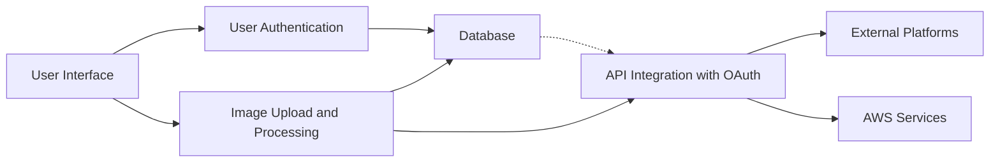
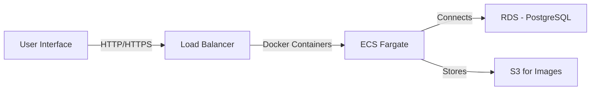
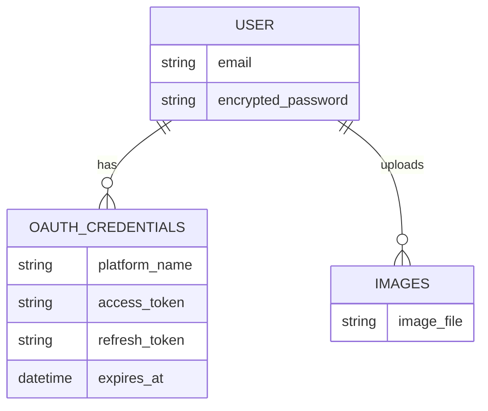
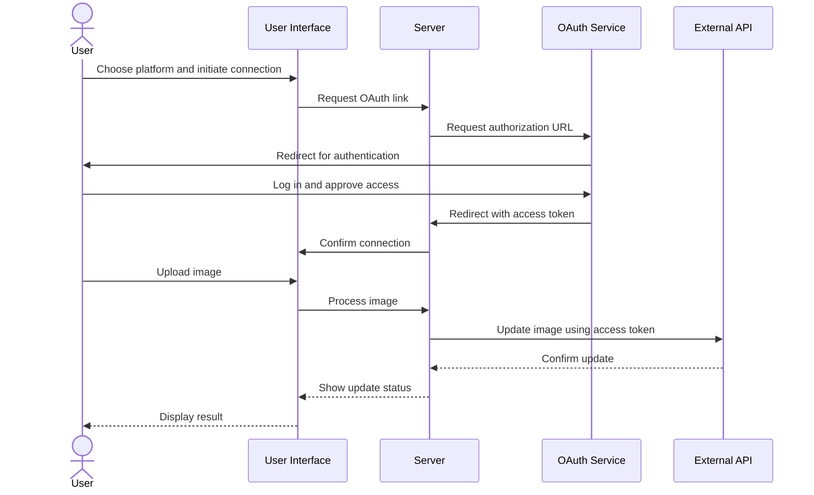

# Loftwah's Guide to System Design: Using Linkarooie as an Example

## Introduction to System Design

System design is a crucial process in software development that involves creating a comprehensive blueprint for a complex system. It encompasses understanding the system's requirements, defining clear specifications, and planning the architecture to ensure scalability, reliability, and maintainability.

## Example System: Linkarooie

### System Overview

Linkarooie is an innovative platform that simplifies how users manage and synchronize their online presence across various platforms. It enables users to upload, manage, and synchronize their profile images and banners, ensuring a consistent and professional digital identity.

### Functional Requirements

1. **User Authentication**: Implement secure and user-friendly authentication for safe access to the platform.
2. **Image Upload**: Provide a centralized interface for users to manage their profile images and banners.
3. **Image Processing**: Automatically adjust and optimize images to meet the specifications of different platforms.
4. **API Integration**: Facilitate seamless connectivity with external platforms to update images across services.
5. **User API Key and Token Management**: Efficiently manage and secure user credentials for various platforms.

### Non-Functional Requirements

1. **Scalability**: The system should be designed to handle a growing user base and increasing data volumes.
2. **Performance**: Ensure fast response times and efficient resource utilization for a smooth user experience.
3. **Security**: Implement robust security measures to protect user data and prevent unauthorized access.
4. **Reliability**: Design the system to be highly available and resilient to failures.

### System Architecture

#### Overview Diagram

#### AWS Architecture

### Components

1. **User Interface**: Develop an intuitive and user-friendly interface for easy management of profile images and banners.
2. **User Authentication**: Utilize robust security measures, like Devise, to ensure user data protection.
3. **Image Upload and Processing**: Implement efficient media handling to streamline the image upload and adjustment process.
4. **API Integration with OAuth**: Establish secure and reliable connections with external platforms for image synchronization.
5. **Database**: Utilize AWS RDS for reliable and scalable data storage solutions.
6. **AWS Services**: Leverage a combination of ECS, Fargate, S3, and RDS to build a scalable and robust infrastructure.

### Database Schema

### API Integration Flow

### Scalability and Performance

1. **Horizontal Scaling**: Utilize load balancers and containerization (e.g., ECS Fargate) to distribute traffic across multiple instances and handle increased load.
2. **Caching**: Implement caching mechanisms (e.g., Redis) to store frequently accessed data and reduce the load on the database.
3. **Database Optimization**: Apply database indexing, query optimization, and data partitioning techniques to improve query performance.
4. **Asynchronous Processing**: Utilize message queues (e.g., SQS) for asynchronous processing of resource-intensive tasks, such as image processing.

### Security and Compliance

1. **Authentication and Authorization**: Implement secure user authentication and role-based access control to protect user data.
2. **Data Encryption**: Encrypt sensitive data both at rest and in transit using industry-standard encryption algorithms.
3. **Secure Communication**: Use HTTPS for all client-server communications to ensure data confidentiality and integrity.
4. **Compliance**: Adhere to relevant data protection regulations (e.g., GDPR, CCPA) and implement necessary measures for compliance.

### Monitoring and Maintenance

1. **Logging and Monitoring**: Implement comprehensive logging and monitoring solutions to track system performance, identify issues, and gather insights.
2. **Alerting**: Set up automated alerts to notify the development and operations teams of any critical issues or anomalies.
3. **Continuous Integration and Deployment (CI/CD)**: Establish a robust CI/CD pipeline to streamline the development, testing, and deployment processes.
4. **Backup and Disaster Recovery**: Regularly backup data and implement disaster recovery mechanisms to ensure data integrity and system availability.

## Development and Deployment

1. **Technology Stack**: Utilize Ruby on Rails as the primary web framework, leveraging its robustness and extensive ecosystem.
2. **Deployment Strategy**: Employ AWS services such as ECS with Fargate for containerization, S3 for image storage, and RDS for the PostgreSQL database.
3. **Image Processing and Standardization**: Ensure images are processed to meet the unique requirements of each platform, maintaining a consistent appearance across services.

## Conclusion

Linkarooie represents a significant advancement in digital identity management, empowering users to synchronize and maintain their online presence efficiently. By following the system design principles outlined in this guide, Linkarooie can be developed as a scalable, secure, and user-friendly platform. The architecture, components, and considerations discussed serve as a solid foundation for building a robust and successful system.