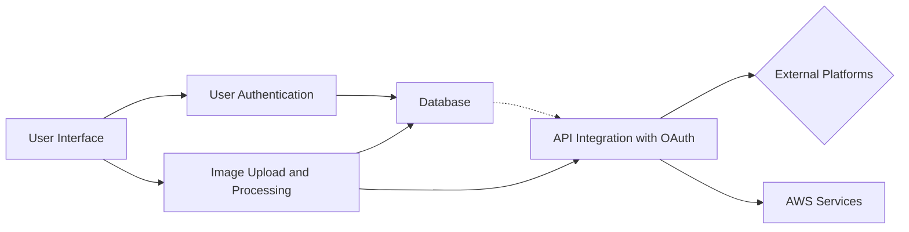
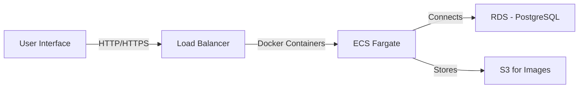
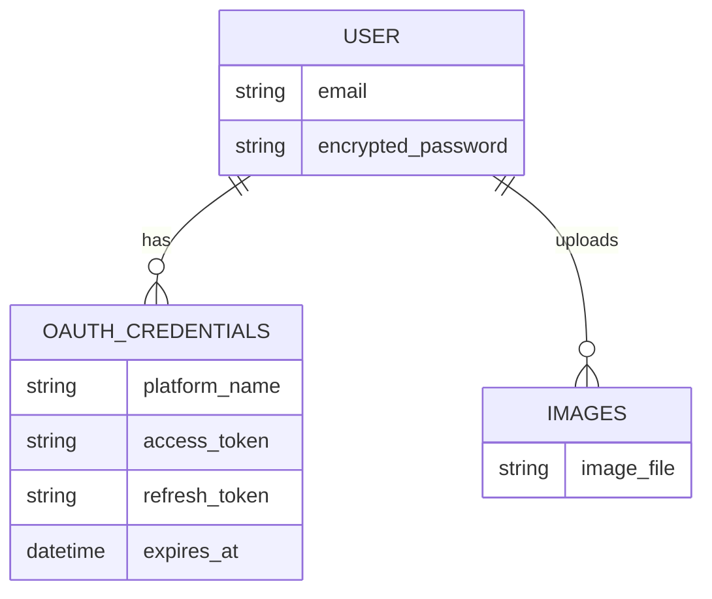
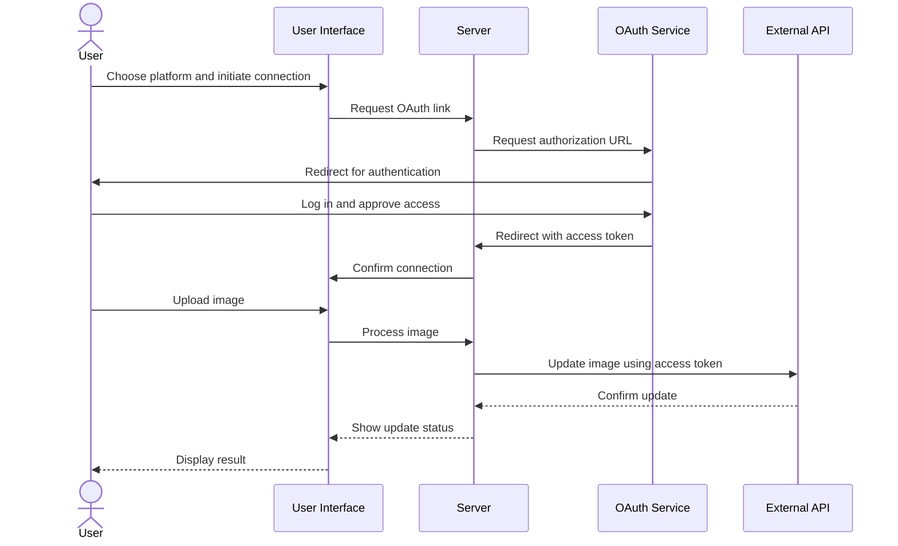

# Design Document for Linkarooie

## Introduction

Linkarooie revolutionizes the way users manage their online presence, enabling a unified and professional digital identity across various platforms.

## System Overview

Linkarooie allows users to upload and synchronize their profile images across multiple online services, streamlining the process of maintaining consistent avatars and banners.

## Functional Requirements

1. **User Authentication**: Secure and straightforward user onboarding.
2. **Image Upload**: A central hub for image management.
3. **Image Processing**: Automated adjustments to fit platform specifications.
4. **API Integration**: Seamless connectivity with external platforms.
5. **User API Key and Token Management**: Efficient handling of user credentials.

## Technical Architecture

## Components

1. **User Interface**: Intuitive and user-friendly.
2. **User Authentication**: Robust security with Devise.
3. **Image Upload and Processing**: Streamlined media handling.
4. **API Integration with OAuth**: Authentic and secure third-party interactions.
5. **Database**: Reliable data storage on AWS RDS.
6. **AWS Services**: Scalable infrastructure utilizing ECS, Fargate, S3, and RDS.

## AWS Architecture

## Database Schema

## API Integration Flow

## Development and Deployment

* **Ruby and Rails**: Stay current with the latest stable releases.
* **Deployment**: Leverage AWS ECS with Fargate for efficient container management, S3 for robust image storage, and RDS for a resilient PostgreSQL database.

> \[!NOTE] Ensure all images are processed to meet individual platform requirements, guaranteeing a seamless and consistent user experience.

## Conclusion

Linkarooie is not just an application, it's a commitment to empowering users to maintain a consistent and professional online image, effortlessly syncing their digital identities across the web's most popular platforms.
